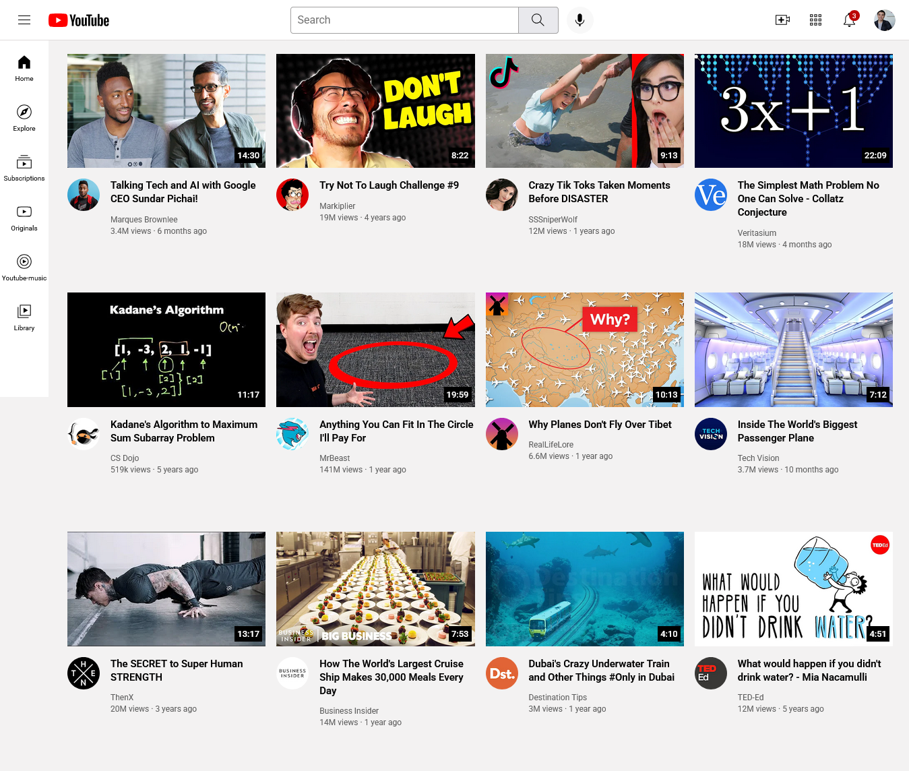

# 🎬 YouTube Landing Page (HTML + CSS)

A clean and responsive YouTube-inspired landing page built using **HTML5** and **CSS3**.  
This project focuses on layout, UI design, and responsive styling — recreating the look of YouTube’s homepage.

Visit Linkon github free page - https://adityarajput772003.github.io/Yotube-landing-Page/index.html
---

## 🚀 Features
- Fully responsive layout  
- Clean and modern UI  
- Video grid section  
- Navigation bar similar to YouTube  
- Hover animations and transitions  

---

## 📸 Screenshots

### ⭐ Homepage Preview  
(Replace `screenshot.png` with your actual screenshot file name)

